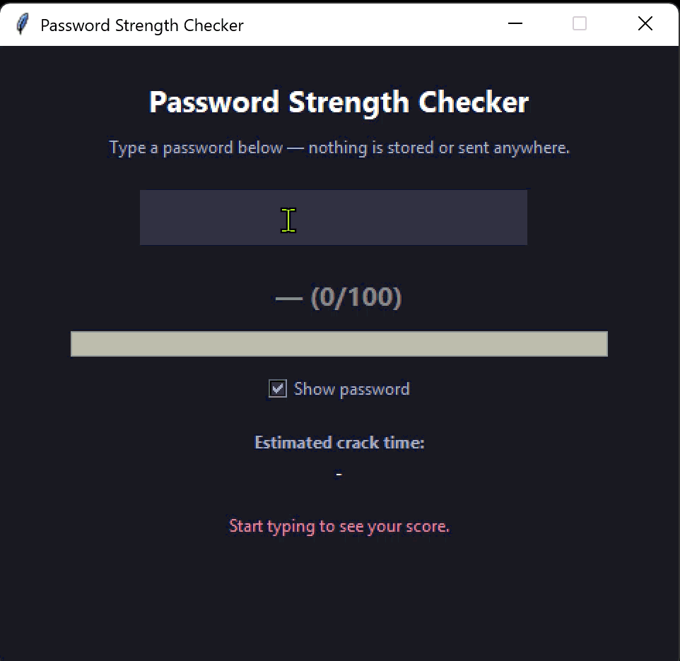

# 🔒 Password Strength Checker

An interactive desktop application built in Python that evaluates password strength in real time. It calculates mathematical entropy, analyzes character diversity, and identifies common patterns or dictionary passwords to estimate offline brute-force cracking resistance.

---

## 🎬 Live Demo



---

## ✨ Features

- **Real-Time Evaluation:** Instant scoring (0–100) and strength classification as you type.
- **Shannon Entropy Analysis:** Calculates logarithmic entropy based on active character pool size.
- **Pattern & Walk Detection:** Flags sequential characters (e.g., `abc`, `123`), repeated sequences, and physical keyboard walks (e.g., `qwerty`, `asdf`).
- **Dictionary Check:** Detects commonly breached passwords and applies severe scoring penalties.
- **Offline Crack Time Estimation:** Provides intuition on brute-force resilience assuming high-speed GPU cracking rigs (~10 billion guesses/sec).
- **Actionable Feedback:** Dynamically generates improvement tips to help create stronger passphrases.
- **Privacy-First Architecture:** Operates entirely locally with intentional user input. No keyloggers, background hooks, telemetry, or network calls.

---

## 🛠️ Concepts Covered

- **Information Theory:** Shannon Entropy
- **Regex & Pattern Analysis:** Character set classification and substring sequence matching
- **GUI Event Binding:** Asynchronous user input handling via `Tkinter`
- **Defensive Design:** Security-first UI choices avoiding global keystroke monitoring

---

## 🚀 Getting Started

### Prerequisites

- Python 3.x
- `tkinter` (Usually included with standard Python installations)

#### Linux Setup (If Tkinter is missing)
```bash
sudo apt-get install python3-tk
